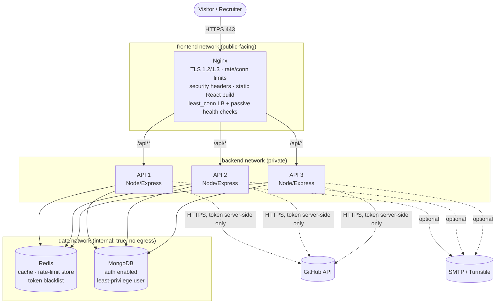

# SOC Portfolio: a security-hardened MERN portfolio

A portfolio site for an aspiring SOC Analyst (L1) that is also the proof of the skills it describes. The site is a hardened React + Express + MongoDB + Redis stack behind an Nginx reverse proxy and load balancer, and its security posture is visible and explainable on the live **Security** page.

[](https://github.com/OWNER/REPO/actions/workflows/ci.yml)
[](https://github.com/OWNER/REPO/actions/workflows/codeql.yml)
[](https://github.com/OWNER/REPO/actions/workflows/trivy.yml)
[](https://github.com/OWNER/REPO/actions/workflows/gitleaks.yml)

> Replace `OWNER/REPO` in the badges with your GitHub path.

## Contents

1. [Features](#features)
2. [Architecture](#architecture)
3. [Repository layout](#repository-layout)
4. [Quick start (local, Docker)](#quick-start-local-docker)
5. [Development without Docker](#development-without-docker)
6. [Configuration](#configuration)
7. [Security controls](#security-controls)
8. [Threat model summary](#threat-model-summary)
9. [API overview](#api-overview)
10. [Testing and CI/CD](#testing-and-cicd)
11. [Deploying to a VPS](#deploying-to-a-vps)
12. [Operations](#operations)
13. [Alternative: Vercel + Render + Atlas](#alternative-vercel--render--atlas)
14. [Known limitations](#known-limitations)

## Features

- Public site: hero with terminal typing effect, about, skills, projects (filterable, managed from the admin panel), live GitHub data, home lab and MITRE ATT&CK mapping, roadmap timeline, markdown blog with tags and search, contact form, downloadable resume, dark/light theme.
- **Security Posture page**: how the site is defended, plus a sanitized 7-day view of blocked events (counts only, no IPs, paths or usernames).
- Admin dashboard (`/admin/login`, not linked from the public nav): CRUD for projects and posts with a live markdown preview, messages inbox, security log viewer, change password.
- Accessibility: semantic HTML, keyboard navigation, `prefers-reduced-motion` respected, WCAG AA colour contrast by design. Run Lighthouse after deploying to confirm your own scores.

## Architecture



**Request flow.** Nginx terminates TLS, applies per-IP rate and connection limits, serves the static React build, and proxies `/api/*` to three Express replicas using `least_conn` with passive health checks (`max_fails` / `fail_timeout`) and one retry on another replica. Express applies the precise, Redis-backed limits, validation, auth and CSRF checks. Redis holds the cache, the rate-limit counters, the login lockout state and the token blacklist. MongoDB holds content, messages and security events.

**Network segmentation.** Only Nginx publishes ports. The `data` network is `internal: true`, so a compromised database or cache container has no route to the internet. Nginx cannot reach MongoDB or Redis at all.

**Cookies.** Auth cookies are `httpOnly`, `Secure` and `SameSite=Strict`. The refresh cookie is scoped to `/api/auth`. Because the SPA and API share one origin behind Nginx, no cross-site cookie relaxation is needed.

## Repository layout

```
.
├── .github/              workflows (CI, CodeQL, Trivy, Gitleaks) + dependabot.yml
├── client/               React (Vite) + Tailwind + Framer Motion + React Router
│   ├── public/           robots.txt, sitemap.xml, theme-init.js, .well-known/security.txt, resume.pdf
│   └── src/              pages/, admin/, components/, data/, api/, hooks.js
├── server/               Express API (MVC): config/, routes/, controllers/, services/,
│                         middleware/, models/, validators/, utils/, tests/
├── nginx/                Dockerfile (builds the client), nginx.conf, conf.d/, snippets/, certs/, acme/
├── docker/mongo/         init-mongo.sh (creates the least-privilege app user)
├── docs/                 threat model + security checklist (Phase 8)
├── docker-compose.yml
├── .env.example
└── README.md
```

## Quick start (local, Docker)

Prerequisites: Docker with Compose v2, Git, OpenSSL.

```bash
git clone https://github.com/OWNER/REPO.git soc-portfolio && cd soc-portfolio
cp .env.example .env
```

1. **Generate secrets.** Edit `.env` and replace every `change_me...` value. Use hex so passwords are safe inside connection URLs:
   ```bash
   openssl rand -hex 24    # database and Redis passwords
   openssl rand -hex 48    # JWT_ACCESS_SECRET, JWT_REFRESH_SECRET, CSRF_SECRET (three DIFFERENT values)
   ```
   Set `CORS_ORIGINS=https://localhost`, leave `COOKIE_DOMAIN=` blank, and set a unique `ADMIN_BOOTSTRAP_PASSWORD` of at least 14 characters.

2. **Create a self-signed certificate** and point Nginx at `localhost` (do not commit this change):
   ```bash
   mkdir -p nginx/certs nginx/acme
   sed -i 's/yourdomain.com/localhost/' nginx/conf.d/default.conf
   openssl req -x509 -newkey rsa:2048 -nodes -days 30 -subj "/CN=localhost" \
     -addext "subjectAltName=DNS:localhost" \
     -keyout nginx/certs/privkey.pem -out nginx/certs/fullchain.pem
   sudo chown 101:101 nginx/certs/*.pem && sudo chmod 600 nginx/certs/privkey.pem
   ```
   On Docker Desktop for Windows or macOS the `chown` is not needed, but it is harmless to skip errors there.

3. **Build and start:**
   ```bash
   docker compose up --build -d
   docker compose ps          # every service should become "healthy"
   ```

4. **Open** `https://localhost` and accept the self-signed certificate warning.

5. **First admin login.** Go to `https://localhost/admin/login`, sign in with the bootstrap credentials, open **Account** and change the password. You will be signed out, so sign in again. Then **delete `ADMIN_BOOTSTRAP_EMAIL` and `ADMIN_BOOTSTRAP_PASSWORD` from `.env`** and run `docker compose up -d` to apply it.

6. **Verify the edge behaviour:**
   ```bash
   curl -skI https://localhost/ | grep -iE 'strict-transport|content-security|x-frame|server'
   curl -sk -A "sqlmap/1.7" -o /dev/null -w "%{http_code}\n" https://localhost/     # 403
   curl -sk -o /dev/null -w "%{http_code}\n" https://localhost/.env                 # 404
   docker compose stop api1 && curl -sk https://localhost/api/health                # still answered
   docker compose start api1
   docker compose logs nginx | tail -5                                              # one JSON event per line
   ```

## Development without Docker

The compose file keeps MongoDB and Redis off the host network on purpose. For day-to-day coding, run throwaway local instances bound to loopback:

```bash
docker run -d --name dev-mongo -p 127.0.0.1:27017:27017 mongo:7.0
docker run -d --name dev-redis -p 127.0.0.1:6379:6379 redis:7.4-alpine
```

Then in `server/`, export the variables (these are for local development only, with no authentication on the throwaway databases):

```bash
export NODE_ENV=development
export MONGO_URI=mongodb://localhost:27017/soc_portfolio
export REDIS_URL=redis://localhost:6379
export JWT_ACCESS_SECRET=$(openssl rand -hex 48) JWT_REFRESH_SECRET=$(openssl rand -hex 48) CSRF_SECRET=$(openssl rand -hex 48)
export CORS_ORIGINS=http://localhost:5173
export ADMIN_BOOTSTRAP_EMAIL=dev@example.com ADMIN_BOOTSTRAP_PASSWORD='dev-only-password-123'
cd server && npm install && npm run dev
```

In a second terminal: `cd client && npm install && npm run dev`, then open `http://localhost:5173`. Vite proxies `/api` to port 5000. Cookies are not `Secure` outside production, so login works over plain HTTP in development.

## Configuration

All secrets come from environment variables. `.env` is git-ignored, `.env.example` documents every variable, and the API refuses to start if a required security setting is missing, malformed, or if the three signing secrets are not distinct.

| Variable | Required | Purpose |
|---|---|---|
| `MONGO_ROOT_USER`, `MONGO_ROOT_PASSWORD` | yes | Used only by the init script to create the app user |
| `MONGO_DB`, `MONGO_APP_USER`, `MONGO_APP_PASSWORD` | yes | Application database and its `readWrite`-only user |
| `REDIS_PASSWORD` | yes | Redis `requirepass` |
| `JWT_ACCESS_SECRET`, `JWT_REFRESH_SECRET`, `CSRF_SECRET` | yes | Three different random values, at least 32 characters each |
| `CORS_ORIGINS` | yes | Comma-separated allowlist, for example `https://yourdomain.com` |
| `COOKIE_DOMAIN` | no | Leave blank for host-only cookies (tighter) |
| `ADMIN_BOOTSTRAP_EMAIL`, `ADMIN_BOOTSTRAP_PASSWORD` | first boot only | Creates the first admin if none exists. Remove after first login. |
| `GITHUB_USERNAME` | no | Account whose public repos are shown |
| `GITHUB_TOKEN` | no | Fine-grained, read-only token that avoids GitHub rate limits. Stays on the server. |
| `TURNSTILE_SECRET`, `TURNSTILE_SITE_KEY` | no | Cloudflare Turnstile. The secret is server-side, the site key is a public build argument. |
| `SMTP_HOST`, `SMTP_PORT`, `SMTP_USER`, `SMTP_PASS`, `NOTIFY_EMAIL` | no | Email notification for new contact messages (STARTTLS required) |

## Security controls

| Layer | Control | Where | Threat it addresses |
|---|---|---|---|
| Transport | TLS 1.2/1.3 only, ECDHE AEAD ciphers, session tickets off, HTTP to HTTPS redirect | `nginx/snippets/tls.conf` | Downgrade, eavesdropping |
| Transport | HSTS (starts conservative, rollout notes in the snippet) | `security-headers.conf`, helmet | SSL stripping |
| Browser | Strict CSP: no inline scripts, no `eval`, `style-src 'self'`, `frame-ancestors 'none'` | `nginx/snippets/csp-spa.conf` | XSS, clickjacking, injection pivots |
| Browser | `nosniff`, `X-Frame-Options`, Referrer-Policy, Permissions-Policy, COOP, CORP | Nginx + helmet | Sniffing, framing, feature abuse |
| Edge | Per-IP request rate and connection limits, tight timeouts and header buffers | `nginx.conf`, `default.conf` | Brute force, scraping, slowloris |
| Edge | Scanner User-Agent and probe-path blocking (noise reduction, logged) | `nginx.conf`, `default.conf` | Automated scanning |
| Edge | Unknown Host / SNI rejected, `server_tokens off` | `default.conf` | IP-based scanners, version fingerprinting |
| Edge | Per-location body size limits (4 KB login, 16 KB default, 512 KB admin posts) | `default.conf` | Oversized-body DoS |
| API | Redis-backed rate limits (login 5 failures/15 min, contact 5/hour, global, admin) | `middleware/rateLimit.js` | Credential stuffing, spam, global limit across 3 replicas |
| API | Zod `.strict()` validation on every route, length caps, https-only URLs | `validators/schemas.js` | Mass assignment, injection, `javascript:` links |
| API | `express-mongo-sanitize`, `strictQuery`, `hpp` | `app.js`, `config/db.js` | NoSQL injection, parameter pollution |
| API | HTML stripping of plain-text fields, CR/LF rejected in single-line fields | `validators/schemas.js` | Stored XSS in admin views, email header and log injection |
| API | Strict CORS allowlist, JSON-only parsing, `x-powered-by` off | `middleware/security.js`, `app.js` | Cross-origin abuse |
| API | Signed double-submit CSRF token + Origin check + `SameSite=Strict` | `middleware/csrf.js` | CSRF |
| Auth | argon2id (OWASP minimums), password length cap | `services/passwordService.js` | Offline cracking, hashing-cost DoS |
| Auth | Account lockout per email, same response for unknown user and wrong password, dummy hash for timing | `lockoutService.js`, `authController.js` | Password guessing, user enumeration |
| Auth | 15-minute access JWT, pinned algorithm/issuer/audience, `httpOnly` `Secure` cookies | `tokenService.js`, `utils/cookies.js` | Token theft via XSS, alg-confusion |
| Auth | Single-use rotating refresh tokens with reuse detection (revokes the whole family) | `tokenService.js` | Stolen refresh token replay |
| Auth | Redis logout blacklist, fails closed if Redis is unavailable | `middleware/auth.js` | Session replay after logout |
| Auth | Deny-by-default admin router: authenticate, RBAC, CSRF, rate limit, schema | `routes/admin.js` | Privilege escalation, unauthenticated admin access |
| Content | Markdown rendered by `react-markdown` with no raw HTML plugin | `components/Markdown.jsx` | Stored XSS through blog posts |
| Contact | Honeypot, rate limit, validation, optional Turnstile (fails closed once configured), plain-text email only | `contactController.js`, `mailService.js` | Bots, spam, mail injection |
| Errors | Central handler, no stack traces or driver messages in production | `middleware/errorHandler.js` | Information disclosure |
| Logging | Structured JSON (pino) with request IDs, redaction of credentials and cookies, de-duplicated persistence | `utils/logger.js`, `securityEventService.js` | Detection and forensics, log injection, write-flood DoS |
| Logging | Nginx JSON access log with limit and block fields | `nginx.conf` | Edge visibility for SIEM |
| Cache | Cache-aside with invalidation on admin writes, bounded key space, no caching of 404s, empties or searches | `cacheService.js`, controllers | Cache poisoning-by-volume, stale data |
| Secrets | Env-only secrets, fail-fast validation, three distinct signing secrets, `.env.example` only in git | `config/env.js` | Secret leakage, weak config |
| Data | MongoDB auth with a `readWrite`-only user, Redis password and disabled `FLUSHALL`/`FLUSHDB`/`CONFIG` | `docker-compose.yml`, `init-mongo.sh` | Blast radius of API compromise |
| Data | TTL retention: messages 180 days, security events 30 days | `models/` | Data minimisation |
| Containers | Non-root, multi-stage, alpine, read-only root FS, `cap_drop: ALL`, `no-new-privileges`, no unnecessary ports | `docker-compose.yml`, Dockerfiles | Container breakout, privilege escalation |
| Network | Frontend, backend and data networks; data network has no egress | `docker-compose.yml` | Lateral movement, exfiltration |
| Pipeline | ESLint security plugin, `npm audit`, CodeQL, Trivy (images and Dockerfiles), Gitleaks, Dependabot | `.github/` | Vulnerable code, dependencies and images, leaked secrets |
| Disclosure | `security.txt` (RFC 9116), `robots.txt` | `client/public/` | Responsible reporting |

## Threat model summary

The full STRIDE analysis and the pre-launch checklist live in [`docs/threat-model.md`](docs/threat-model.md) and [`docs/security-checklist.md`](docs/security-checklist.md).

**Assets.** The admin account and its sessions, the signing secrets, the MongoDB data (visitor messages contain email addresses and IPs), the integrity of published content, and the availability of the site.

**Trust boundaries.** Internet to Nginx. Nginx to API. API to the data tier. API to external services (GitHub, SMTP, Turnstile). CI/CD and the Git repository to production.

| Threat | Main mitigations | Residual risk |
|---|---|---|
| Admin credential guessing or stuffing | argon2id, per-IP and per-email limits, lockout, generic errors, security log | No MFA (see below) |
| Session theft or replay | `httpOnly` cookies, short access tokens, rotation with reuse detection, blacklist | A fully compromised browser |
| XSS (including via blog content) | No raw HTML rendering, strict CSP, HTML stripping on plain-text fields | A dependency flaw in the markdown renderer |
| CSRF | SameSite=Strict, Origin check, signed token | Low |
| NoSQL or parameter injection | Zod strict schemas, mongo-sanitize, hpp, strictQuery | Low |
| DoS (volumetric or application) | Two rate-limit layers, body and connection limits, bounded cache and log writes | A large volumetric attack on a single VPS |
| Compromised API container | Non-root, read-only FS, no capabilities, least-privilege DB user, internal data network | Attacker can read and write the one app database |
| Supply chain | Lockfiles, `npm ci`, Dependabot, audit, Trivy, CodeQL | Zero-day in a dependency |
| Secret exposure | Env-only, Gitleaks, push protection, git-ignored `.env` | Host compromise exposes `.env` |
| Contact-form abuse | Honeypot, rate limit, Turnstile, validation | Determined human spammers |

## API overview

| Method and path | Access | Notes |
|---|---|---|
| `GET /api/health` | public | Liveness, no dependencies, never rate limited |
| `GET /api/ready` | public | Readiness: MongoDB and Redis |
| `GET /api/projects`, `/posts`, `/posts/:slug`, `/github` | public | Strict query schema, Redis cache |
| `GET /api/security/posture` | public | Aggregated counts only, cached 60 s |
| `POST /api/contact` | public | CSRF, 5/hour, validation, honeypot, Turnstile |
| `GET /api/auth/csrf` | public | Issues the signed CSRF token |
| `POST /api/auth/login` | public | Limiter, CSRF, lockout, argon2id |
| `POST /api/auth/refresh`, `/logout`, `/change-password` | session | CSRF, rotation and reuse detection, blacklist |
| `GET /api/auth/me` | session | Current role |
| `/api/admin/*` | admin | Projects, posts, messages, security events. Authenticated, RBAC, CSRF, rate limited. |

## Testing and CI/CD

```bash
cd server && npm ci && npm run lint && npm test
cd client && npm ci && npm run build
```

Jest and Supertest cover validation (NoSQL operators, mass assignment, header injection, length caps) and auth (CSRF, lockout, enumeration resistance, cookie flags, logout blacklist, refresh rotation and reuse detection). The tests use an in-memory Redis and stubbed models, so no services are needed.

GitHub Actions run on every push and pull request, and weekly on a schedule: lint + tests + build + `npm audit` (`ci.yml`), CodeQL (`codeql.yml`), Trivy on both images and the Dockerfiles (`trivy.yml`), and Gitleaks over the full git history (`gitleaks.yml`). Dependabot keeps npm, Docker, Compose and Actions versions current. Recommended branch protection: require all of these checks on `main`.

## Deploying to a VPS

This guide assumes Ubuntu 24.04 LTS, a VPS with at least 2 GB RAM, and a domain you control. Replace `yourdomain.com` and `deploy` with your own values.

### 1. DNS

Create an `A` record for `yourdomain.com` pointing to the VPS public IP. Wait until `dig +short yourdomain.com` returns it. Certificate issuance in step 6 will fail until DNS resolves.

### 2. Harden the server

```bash
# As root, once:
adduser deploy && usermod -aG sudo deploy
rsync --archive --chown=deploy:deploy ~/.ssh /home/deploy      # copy your SSH key

# Confirm you can SSH in as "deploy" with your key from a SECOND terminal, then:
sed -i 's/^#\?PasswordAuthentication.*/PasswordAuthentication no/' /etc/ssh/sshd_config
sed -i 's/^#\?PermitRootLogin.*/PermitRootLogin no/' /etc/ssh/sshd_config
systemctl restart ssh

apt update && apt -y upgrade
apt -y install ufw unattended-upgrades fail2ban
dpkg-reconfigure -plow unattended-upgrades

ufw default deny incoming && ufw default allow outgoing
ufw allow OpenSSH && ufw allow 80/tcp && ufw allow 443/tcp
ufw enable
```

Note that Docker publishes ports by editing iptables directly, which bypasses UFW rules. That is acceptable here because the stack publishes only ports 80 and 443. Never add a `ports:` entry to MongoDB, Redis or the API.

### 3. Install Docker

Follow the official instructions at <https://docs.docker.com/engine/install/ubuntu/> (Docker's apt repository, which includes the Compose plugin), then:

```bash
sudo usermod -aG docker deploy      # log out and back in afterwards
```

Limit log growth so JSON logs cannot fill the disk. Create `/etc/docker/daemon.json`:

```json
{ "log-driver": "json-file", "log-opts": { "max-size": "10m", "max-file": "5" } }
```

Then `sudo systemctl restart docker`.

### 4. Get the code and configure

```bash
git clone https://github.com/OWNER/REPO.git ~/soc-portfolio && cd ~/soc-portfolio
cp .env.example .env && chmod 600 .env
nano .env        # generate every secret as shown in the quick start
```

For production set `CORS_ORIGINS=https://yourdomain.com`, leave `COOKIE_DOMAIN=` blank, and set the bootstrap admin credentials (removed after the first login).

Replace the domain placeholder everywhere it appears:

```bash
grep -rl yourdomain.com nginx client/index.html client/public | xargs sed -i 's/yourdomain.com/YOUR.REAL.DOMAIN/g'
```

Before the first deploy, also add `client/public/resume.pdf`, `favicon.svg` and `og-image.png` (1200x630), and set your real skill levels in `client/src/data/profile.js`. Renew `Expires` in `security.txt` before it lapses.

### 5. Start with a temporary certificate

Nginx will not start without a certificate file, and Let's Encrypt needs Nginx to answer the HTTP challenge. Break the loop with a short-lived self-signed certificate:

```bash
mkdir -p nginx/certs nginx/acme
openssl req -x509 -newkey rsa:2048 -nodes -days 2 -subj "/CN=yourdomain.com" \
  -keyout nginx/certs/privkey.pem -out nginx/certs/fullchain.pem
sudo chown 101:101 nginx/certs/*.pem && sudo chmod 600 nginx/certs/*.pem

docker compose up --build -d
docker compose ps
```

### 6. Issue the real certificate (Let's Encrypt, webroot)

```bash
sudo apt -y install certbot
sudo certbot certonly --webroot -w ~/soc-portfolio/nginx/acme -d yourdomain.com \
  --agree-tos -m you@example.com --no-eff-email
```

Nginx serves `/.well-known/acme-challenge/` from `nginx/acme`, so certbot works while the site stays up. Install the certificate and reload Nginx:

```bash
sudo install -m 600 -o 101 -g 101 /etc/letsencrypt/live/yourdomain.com/fullchain.pem nginx/certs/fullchain.pem
sudo install -m 600 -o 101 -g 101 /etc/letsencrypt/live/yourdomain.com/privkey.pem   nginx/certs/privkey.pem
docker compose exec nginx nginx -s reload
```

### 7. Automate renewal

Create `/etc/letsencrypt/renewal-hooks/deploy/soc-portfolio.sh` (replace the domain and the path if yours differ):

```bash
#!/bin/bash
set -euo pipefail
DOMAIN=yourdomain.com
APP=/home/deploy/soc-portfolio
install -m 600 -o 101 -g 101 /etc/letsencrypt/live/$DOMAIN/fullchain.pem $APP/nginx/certs/fullchain.pem
install -m 600 -o 101 -g 101 /etc/letsencrypt/live/$DOMAIN/privkey.pem   $APP/nginx/certs/privkey.pem
cd $APP && docker compose exec -T nginx nginx -s reload
```

```bash
sudo chmod +x /etc/letsencrypt/renewal-hooks/deploy/soc-portfolio.sh
sudo certbot renew --dry-run        # must succeed
```

The certbot package installs a systemd timer that runs renewals twice a day, and the deploy hook runs only when a certificate was actually renewed.

### 8. First login and cleanup

1. Open `https://yourdomain.com/admin/login`, sign in with the bootstrap credentials, change the password under **Account**, and sign in again.
2. Remove `ADMIN_BOOTSTRAP_EMAIL` and `ADMIN_BOOTSTRAP_PASSWORD` from `.env`, then `docker compose up -d`.
3. Add your projects (start with Cyber Intel Board) and publish your first write-up.

### 9. HSTS rollout

`security-headers.conf` ships with `max-age=31536000`, which locks browsers into HTTPS for a year. For the very first deploy, lower it to `max-age=300`, confirm everything works, then raise it. Add `includeSubDomains` only when every subdomain is HTTPS, and `preload` only if you intend to submit the domain to hstspreload.org, which is hard to undo.

### 10. Verify the deployment

```bash
curl -sI https://yourdomain.com | grep -iE 'strict-transport|content-security|x-content-type|server'
curl -sI http://yourdomain.com | head -3                 # 301 to https
curl -s  https://yourdomain.com/api/health               # {"status":"ok",...}
nmap -Pn -p- YOUR.VPS.IP                                 # only 22, 80, 443 open (scan only your own server)
```

Then grade TLS with SSL Labs (<https://www.ssllabs.com/ssltest/>), check headers with securityheaders.com, and run Lighthouse on the live URL. If you put Cloudflare in front, add `set_real_ip_from` ranges and `real_ip_header CF-Connecting-IP;` to `nginx.conf`, otherwise every visitor shares one IP for rate limiting.

## Operations

**Update:**
```bash
cd ~/soc-portfolio && git pull && docker compose up -d --build
```
The API replicas shut down gracefully and Nginx fails over between them, but the three replicas restart together, so expect a brief blip.

**Logs for a SIEM.** Every service writes one JSON event per line to stdout. Application security events carry `event_type: "security"` and an `event` name (`failed_login`, `account_locked`, `rate_limit_hit`, `csrf_failure`, `nosql_injection_blocked`, ...). Nginx access events carry `limit_req`, `limit_conn` and `blocked_ua` fields.
```bash
docker compose logs -f api1 api2 api3 | grep '"event_type":"security"'
docker compose logs nginx | grep '"blocked_ua":"1"'
```
To ingest into Wazuh, Splunk or ELK, ship `/var/lib/docker/containers/*/*-json.log` with the agent's Docker or file collector. Pairing this stack with your own lab SIEM is a good write-up.

**Backups.** Back up MongoDB regularly and test the restore:
```bash
docker compose exec -T mongo sh -c 'mongodump --username "$MONGO_INITDB_ROOT_USERNAME" --password "$MONGO_INITDB_ROOT_PASSWORD" --authenticationDatabase admin --db "$MONGO_DB" --archive --gzip' > backup-$(date +%F).archive.gz
```
Store copies off the server. The dump contains visitor email addresses and IPs, so encrypt it. Redis holds only cache and session-control data and needs no backup.

**Rotate secrets.** Changing `JWT_*` or `CSRF_SECRET` signs everyone out, which is fine. Changing database passwords requires updating the MongoDB user as well, because `init-mongo.sh` runs only on an empty data volume.

**If you suspect compromise:** rotate all secrets, change the admin password (this revokes every session), review `docker compose logs` and the admin Security log, and rebuild the containers from a clean checkout.

## Alternative: Vercel + Render + Atlas

You can host the frontend on Vercel, the API on Render and the data on MongoDB Atlas and Render Key Value instead of a VPS. Be aware of what changes:

- Nginx, the three-replica load balancer, Nginx rate limits and Nginx logs do not exist. The Express controls remain, and the Security page text should be updated to match.
- The auth cookies are `SameSite=Strict`, so the browser must only ever talk to your Vercel domain. A Vercel rewrite proxies `/api/*` to Render. A direct cross-site call from the Vercel page to `onrender.com` would silently break login.
- The API sits behind two proxies instead of one, so `trust proxy 1` is not correct there. A configurable hop count is needed so rate limits and logs see real client IPs.
- Neither `client/vercel.json` (rewrite, SPA fallback and security headers) nor the configurable `trust proxy` setting is in this repository yet.

## Known limitations

- **No MFA on the admin account.** Strong password hashing, lockout and rate limits reduce the risk, but TOTP for the admin login is the most valuable next control.
- **Single admin, single server.** Lockout is keyed by email, so someone can lock you out for 15 minutes by guessing wrong passwords. A single VPS is a single point of failure for availability.
- **Passive health checks only.** Nginx open source has no active health checks, so the first request to a dead replica waits up to 3 seconds before being retried.
- **Nginx blocks are not on the public Security page.** Nginx does not write to Redis, so its 429 and 403 events appear only in its JSON access log.
- **No Brotli.** The stock Nginx image has no Brotli module. Static assets are pre-compressed with gzip at build time.
- **User-Agent blocking is noise reduction.** It is trivially bypassed and exists mainly to label scanner traffic in the logs.
- **Redis uses `allkeys-lru`.** On a 128 MB instance with this dataset, eviction of security keys is unlikely, and cache keys are bounded to keep it that way.

## License

Choose a license before publishing, for example MIT. Add a `LICENSE` file and name it here.