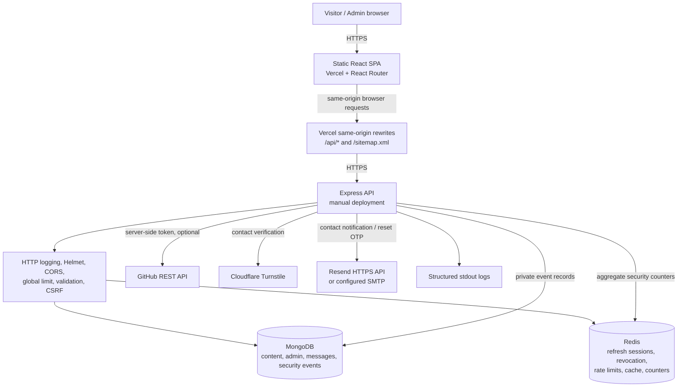

# Engineering audit

**Status:** Stage 1 code/configuration review, 2026-10-03. This is not a penetration test, production smoke test, or confirmation of provider-side settings. Findings are based on the checked-in application and tests.

## Scope and deployment assumptions

The repository contains a React/Vite single-page application, an Express/Mongoose API, Redis-backed authentication/rate limits/cache, and an optional Docker Compose/Nginx reference stack. The owner-confirmed API origin is `https://my-portfolio-tlnr.onrender.com`; the frontend's Vercel rewrite proxies `/api/*` and `/sitemap.xml` to it. The API is manually managed; the checked-in Compose and Nginx files do not establish the live production topology.

The API connects to MongoDB and Redis at startup and refuses to listen if either is unavailable. Exact production proxy hops, CORS values, credentials, persistence, and provider health still require operator-side verification. Keep the existing MongoDB database unless a separately verified migration is requested.

## Architecture and trust boundaries

### Frontend and API communication

- The client is a Vite-built React 18 SPA using React Router, a small fetch wrapper, page-level API hooks, Tailwind utilities, and Framer Motion.
- Requests use relative `/api` paths and same-origin credentials. Vercel proxies them to the configured API host; this preserves host-only, `SameSite=Strict` cookies.
- The Vite development server proxies `/api` to `http://localhost:5000`. Production client headers, rewrites, and SPA fallback are in `client/vercel.json`.
- Route metadata is updated after React hydration. The static HTML has generic site metadata; it is not SSR or static generation for each route.

### Backend and API

- `server/src/app.js` composes request logging, Helmet, permissions policy, no-store defaults, liveness/readiness routes, strict CORS, global limiting, bounded JSON parsing, cookie parsing, Mongo sanitization, HTTP parameter-pollution protection, API routes, and centralized error handling.
- Routes are grouped into public, authentication, and admin routers. Admin middleware is deny-by-default: authenticated session, database-backed `admin` role, CSRF for writes, and an admin rate limit.
- Zod schemas validate bodies, query parameters, and route parameters. Schemas are strict to reject unknown/mass-assigned fields.
- API errors use `{ error: { code, message, requestId, details? } }`; production 5xx responses omit stack traces and internal details.

### Authentication and security boundaries

- Passwords are Argon2id hashes. Access and refresh JWTs are HS256, use separate secrets/audiences, and are delivered only as HttpOnly cookies.
- Access tokens last 15 minutes; refresh tokens are single-use Redis allowlist entries with reuse detection and a 30-day absolute session age. `authVersion` invalidates existing access and refresh sessions after password changes/resets and logout-all.
- Logout blacklists an access-token `jti` in Redis and revokes the refresh token. Redis failures on security-sensitive decisions fail closed.
- CSRF uses an HMAC-signed double-submit cookie and header plus SameSite and Origin checks. Browser writes obtain the CSRF token from `/api/auth/csrf`.
- The client coordinates cross-tab refresh with the Web Locks API, with a bounded local-storage lease and BroadcastChannel notification fallback; it fails closed if neither coordination mechanism is available.
- The local-storage lease reduces duplicate refreshes but is not an atomic distributed lock. Redis single-use refresh consumption/reuse detection remains authoritative; an extremely rare competing refresh still fails closed and may require the admin to sign in again.
- Cookies are host-only unless `COOKIE_DOMAIN` is explicitly set. Access and CSRF cookies use `/api`; refresh cookies use `/api/auth`. Clearing uses the same paths as issuance.
- CORS is an allowlist, not an authentication mechanism. Proxy trust is configurable; `TRUST_PROXY_HOPS` must be measured against the deployed ingress chain and spoof-tested.
- Public security posture returns aggregate counts only. Detailed event records, including IPs, are behind admin authorization. Structured logs contain request identifiers and bounded context; provider retention/access remains an operator responsibility.

#### Cookie inventory

| Cookie | Purpose | Path | SameSite | Secure | HttpOnly | Domain | Max age |
|---|---|---|---|---|---|---|---|
| `access_token` | Short-lived admin access JWT | `/api` | Strict | Production only | Yes | Host-only by default; optional `COOKIE_DOMAIN` | 15 minutes |
| `refresh_token` | Single-use refresh JWT | `/api/auth` | Strict | Production only | Yes | Host-only by default; optional `COOKIE_DOMAIN` | 7 days |
| `csrf_token` | HMAC-signed double-submit CSRF token | `/api` | Strict | Production only | Yes; returned separately in CSRF JSON response | Host-only by default; optional `COOKIE_DOMAIN` | 2 hours |

### Data, Redis, and integrations

- MongoDB stores admin users, projects, posts, contact messages, and detailed security events. Contact messages are persisted before asynchronous email notification, so delivery failures do not discard submissions.
- Existing retention indexes expire contact PII after 180 days and detailed security events after 30 days. Post search/publication, project category/slug, and event type/time have indexes associated with current query patterns.
- Redis is required at startup and is used for refresh sessions, access revocation, lockout state, rate-limit counters, cache namespaces, and public security aggregates. Cache failures are generally best-effort; security-state failures are not.
- GitHub data is fetched server-side from the fixed GitHub API host. An optional server-only token can fall back to unauthenticated requests after a rejected credential. Fresh and stale copies share the versioned cache abstraction; Redis uses a separate coordination lock.
- Contact submissions are checked with Turnstile and can send notifications via Resend or explicitly configured SMTP. Admin password-reset OTPs use the configured mail transport.

## Findings

Severity uses P0 (critical), P1 (high), P2 (medium), and P3 (low). No P0 issue was established in this code/configuration review. Findings marked open must be addressed or explicitly accepted before claiming the corresponding behavior is fixed.

| ID | Priority | File / approximate location | Finding and impact | Treatment | Verification / status |
|---|---|---|---|---|---|
| E-1 | P1 High | `server/src/utils/cookies.js`, `clearAuthCookies` | Access cookie had been issued at `Path=/api` but cleared at `Path=/`. Cookie deletion requires matching path/domain attributes, so the browser could retain the access cookie after logout or password change. Server-side revocation remained in place. | Clearing now uses `Path=/api`, matching issuance. | `server/tests/auth.test.js` asserts issuance and expiry paths. **Resolved in this worktree.** |
| E-2 | P2 Medium | `server/src/services/githubService.js`; `server/src/services/cacheService.js` | GitHub refresh wrote `cache:github:repos` directly, while normal cache-aside access used the versioned `cache:github:v…:repos` key. This duplicated representations and made lock-wait/stale paths harder to invalidate consistently. | Fresh/stale GitHub values and lock-wait reads now use the shared versioned cache abstraction; the Redis coordination lock remains separate. | Cache tests cover warm/cold, invalidation races, cache failure, and TTL commands; GitHub tests cover concurrent refresh and stale fallback. **Resolved in this worktree.** |
| E-3 | P2 Medium | `client/src/api/client.js`, refresh coordination; `server/src/services/tokenService.js`, `consumeRefresh` | Automatic cross-tab refresh originally required `navigator.locks`; browsers without it failed closed even when the session was otherwise valid. The server must also prevent two requests from consuming the same refresh token. | Web Locks remain primary; unsupported browsers now coordinate through a bounded local-storage lease with BroadcastChannel notifications. Same-tab logout is serialized with refresh, and absence of both mechanisms still fails closed. Server-side Redis rotation remains single-use and treats reuse as a session-family compromise. | Client tests cover two-tab lease coordination, refresh failure, logout during refresh, and unavailable coordination; server tests prove concurrent requests cannot both consume one token. **Resolved in this worktree.** |
| E-4 | P2 Medium | `client/index.html`; `client/src/hooks.js` | Public route title/description/canonical updates happen client-side, while crawlers and link previews initially receive generic root metadata. SPA fallback makes routes load, but does not provide route-specific HTML metadata before hydration. | Evaluate prerendering or static generation against the current Vite setup; preserve route content/API behavior and verify canonical, Open Graph, Twitter, and structured data per public route. | Current E2E covers routes; no crawler/HTML metadata regression test exists. |
| E-5 | P2 Medium | `server/src/controllers/projectController.js`, `postController.js`; `server/tests/` | Project and post public/admin handlers have schema/query coverage but no dedicated controller/API integration coverage for read/write, publication, cache invalidation, pagination, and empty/error behavior. Regressions in the content flows can therefore escape the current endpoint tests. | Add focused integration tests for public visibility, admin authorization, CRUD response contracts, cache invalidation, and pagination before changing these handlers. | Validator tests cover schemas; no project/post route integration tests were found. |
| E-6 | P3 Low | `client/package.json`; client source | The client has unit and Playwright scripts but no lint or typecheck script; JSX/JS remains without a dedicated static type-check step. | Consider adding client ESLint configuration and gradually typed API contracts only if the maintenance benefit justifies the setup. Do not convert the project wholesale solely for audit completeness. | CI currently runs client unit tests, Playwright, build, and production dependency audit; no client lint/typecheck. |
| E-7 | P2 Medium | `client/package-lock.json` (`react-router-dom`) | The previous production dependency audit reported two moderate React Router advisories: `GHSA-wrjc-x8rr-h8h6` (backslash-based open redirect in navigation) and `GHSA-337j-9hxr-rhxg` (constructor injection in SSR hydration error deserialization). | Upgraded from Router 6.30.6 to 7.18.4 after reviewing the major-version scope. | Client unit tests, all 6 Playwright tests, production build, and `npm audit --omit=dev --audit-level=moderate` pass; production audit reports 0 vulnerabilities. **Resolved in this worktree.** |
| E-8 | P2 Medium | `client/package-lock.json` (development-only Tailwind CSS 3 dependency tree) | Full client dependency audit reports 5 high-severity findings in the dev tree, including `GHSA-vfj7-8cjw-p6xm` (braces stack exhaustion through nested patterns) pulled through Tailwind CSS 3's chokidar/fast-glob/micromatch tree. These dependencies are not shipped as production runtime dependencies, but affect developer/CI build inputs. | Assess a safe transitive fix or a separate Tailwind 4 migration with CSS/config and full visual regression testing; do not force-upgrade in the Router change. | Production-only audit is clean; full audit remains nonzero. Tailwind migration has not been performed. |

## Existing protections and test coverage

The backend suite covers authentication, refresh rotation/reuse, CSRF, validation, login lockout, sensitive rate-limit failure behavior, contact persistence, password reset, health readiness, cache-aside invalidation, GitHub token fallback, and sitemap escaping. The client has API unit tests and Playwright coverage for public navigation/contact and core admin flows. CI runs server lint/tests/audit and client tests/E2E/build/audit.

Known coverage gaps relevant to the findings are listed above. Code review alone cannot establish production CORS/proxy settings, database backups, provider availability, real email delivery, or live domain health; verify those against the deployment after changes.

## Stage status

- Stage 1: architecture, API, and dependency migration documentation completed.
- Stage 2: E-1 through E-3 have targeted fixes and regression coverage in this worktree.
- Stage 4: Router v7 migration completed and production dependency audit is clean. E-8 remains open in the client development dependency tree.
- Later stages: justified refactoring, visual redesign, responsive/accessibility review, and route-specific SEO/prerendering. Do not infer live deployment changes from the local reference stack.
